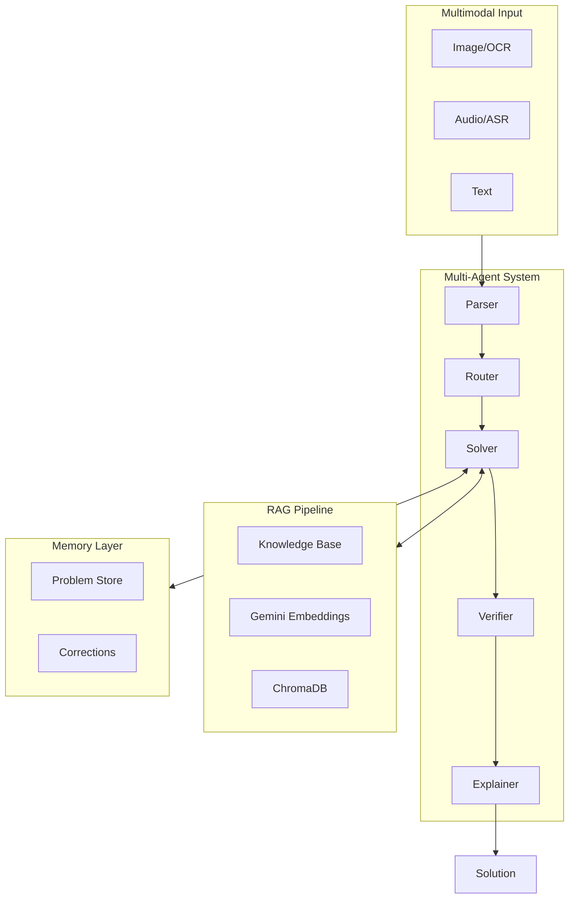

# Math Mentor - AI-Powered JEE Math Tutor

🧮 **A Multimodal AI Application for Solving JEE-Style Math Problems**

[](https://streamlit.io)
[](https://python.org)
[](https://ai.google.dev)

## 🌟 Features

### Multimodal Input
- **📷 Image Input**: Upload photos/screenshots of math problems with OCR extraction
- **🎤 Audio Input**: Speak your math question with automatic transcription
- **⌨️ Text Input**: Type your problem directly

### Multi-Agent Architecture
- **Parser Agent**: Converts raw input to structured math problems
- **Router Agent**: Classifies problem type and routes to optimal solver
- **Solver Agent**: Solves using RAG-enhanced reasoning and tools
- **Verifier Agent**: Validates correctness and triggers HITL when uncertain
- **Explainer Agent**: Generates step-by-step student-friendly explanations

### RAG Pipeline
- Curated knowledge base with 30+ JEE-level math documents
- Gemini embeddings for semantic search
- ChromaDB vector store for fast retrieval
- Source attribution (no hallucinated citations)

### Human-in-the-Loop (HITL)
- Automatic triggers for low confidence OCR/ASR
- Parser ambiguity detection
- Verifier uncertainty handling
- User correction interface

### Memory & Self-Learning
- SQLite-based problem-solution storage
- Similar problem retrieval
- Pattern learning from corrections
- User feedback integration

## 📚 Topics Covered

| Category | Topics |
|----------|--------|
| **Algebra** | Quadratic Equations, Polynomials, Inequalities, Progressions, Logarithms |
| **Probability** | Basic Probability, Permutations & Combinations, Distributions |
| **Calculus** | Limits, Derivatives, Applications, Integration |
| **Linear Algebra** | Matrices, Determinants, Vectors |

## 🏗️ Architecture



## 🚀 Quick Start

### Prerequisites
- Python 3.9 or higher
- pip (Python package manager)

### Installation

1. **Clone the repository**
```bash
git clone https://github.com/yourusername/math-mentor.git
cd math-mentor
```

2. **Create virtual environment**
```bash
python -m venv venv
source venv/bin/activate  # On Windows: venv\Scripts\activate
```

3. **Install dependencies**
```bash
pip install -r requirements.txt
```

4. **Set up environment variables**
```bash
cp .env.example .env
# Edit .env and add your GEMINI_API_KEY
```

5. **Run the application**
```bash
streamlit run app.py
```

6. **Open in browser**
Navigate to `http://localhost:8501`

## 🔧 Configuration

### Environment Variables

| Variable | Description | Default |
|----------|-------------|---------|
| `GEMINI_API_KEY` | Google Gemini API key | Required |
| `GEMINI_MODEL` | Gemini model name | gemini-1.5-flash |
| `EMBEDDING_MODEL` | Embedding model | models/embedding-001 |
| `WHISPER_MODEL` | Whisper model size | base |
| `OCR_CONFIDENCE_THRESHOLD` | OCR HITL trigger | 0.6 |
| `ASR_CONFIDENCE_THRESHOLD` | ASR HITL trigger | 0.7 |
| `VERIFIER_CONFIDENCE_THRESHOLD` | Verifier HITL trigger | 0.7 |
| `RAG_TOP_K` | Number of RAG results | 5 |

## 📂 Project Structure

```
math-mentor/
├── app.py                      # Main Streamlit application
├── requirements.txt            # Dependencies
├── .env.example               # Environment template
├── .streamlit/config.toml     # Streamlit config
│
├── config/                    # Configuration
│   └── settings.py           # Settings management
│
├── agents/                    # Multi-agent system
│   ├── base_agent.py         # Base agent class
│   ├── parser_agent.py       # Input parsing
│   ├── router_agent.py       # Problem routing
│   ├── solver_agent.py       # Problem solving
│   ├── verifier_agent.py     # Solution verification
│   ├── explainer_agent.py    # Explanation generation
│   └── orchestrator.py       # Agent coordination
│
├── rag/                       # RAG pipeline
│   ├── embeddings.py         # Gemini embeddings
│   ├── vector_store.py       # ChromaDB store
│   ├── retriever.py          # Context retrieval
│   └── knowledge_base.py     # KB loader
│
├── input_handlers/            # Input processing
│   ├── image_handler.py      # OCR processing
│   ├── audio_handler.py      # ASR processing
│   └── text_handler.py       # Text processing
│
├── hitl/                      # Human-in-the-Loop
│   ├── triggers.py           # HITL triggers
│   └── corrections.py        # Correction handling
│
├── memory/                    # Memory & learning
│   ├── memory_store.py       # SQLite storage
│   ├── similarity.py         # Similar problem search
│   └── patterns.py           # Pattern learning
│
├── ui/                        # UI components
│   ├── components.py         # Streamlit components
│   ├── styles.py             # CSS styling
│   └── agent_trace.py        # Trace visualization
│
├── utils/                     # Utilities
│   ├── math_tools.py         # Calculator, SymPy
│   └── text_processing.py    # Text utilities
│
├── knowledge_base/            # Math knowledge
│   ├── algebra/              # Algebra topics
│   ├── probability/          # Probability topics
│   ├── calculus/             # Calculus topics
│   ├── linear_algebra/       # Linear algebra
│   └── common_mistakes/      # Pitfalls
│
└── data/                      # Runtime data
    ├── memory.db             # Problem memory
    └── chroma_db/            # Vector store
```

## 🎯 Usage Examples

### Text Input
```
Type: "Find the roots of x² - 5x + 6 = 0"
```

### Image Input
1. Upload a photo of a handwritten math problem
2. Review the OCR extraction
3. Edit if needed, then solve

### Audio Input
1. Record or upload: "What is the derivative of x squared plus 3x"
2. Review the transcription
3. Solve

## 📊 Demo Scenarios

### 1. Image → Solution Flow
- Upload a screenshot of a quadratic equation
- OCR extracts the problem
- Agent trace shows parsing → routing → solving
- Step-by-step solution with explanation

### 2. HITL in Action
- Upload a blurry image (low OCR confidence)
- HITL triggers automatically
- Edit the extracted text
- Continue to solution

### 3. Memory Reuse
- Solve: "Find roots of x² - 4 = 0"
- Later solve: "Find roots of x² - 9 = 0"
- System shows similar previously solved problem
- Solution incorporates learned patterns

## 🚀 Deployment

### Streamlit Cloud

1. Push to GitHub
2. Connect to Streamlit Cloud
3. Add secrets:
```toml
GEMINI_API_KEY = "your-api-key"
```
4. Deploy!

### Docker

```dockerfile
FROM python:3.9-slim
WORKDIR /app
COPY requirements.txt .
RUN pip install -r requirements.txt
COPY . .
EXPOSE 8501
CMD ["streamlit", "run", "app.py"]
```

## 🧪 Testing

```bash
# Test RAG pipeline
python -c "from rag.retriever import Retriever; r = Retriever(); print(r.retrieve('quadratic formula'))"

# Test memory store
python -c "from memory.memory_store import MemoryStore; m = MemoryStore(); print(m.test_connection())"
```

## 📝 License

MIT License - feel free to use and modify!

## 👥 Contributing

1. Fork the repository
2. Create your feature branch
3. Commit your changes
4. Push to the branch
5. Open a Pull Request

## 🙏 Acknowledgments

- Google Gemini for AI capabilities
- Streamlit for the amazing UI framework
- EasyOCR for image text extraction
- OpenAI Whisper for speech recognition
- ChromaDB for vector storage
- SymPy for symbolic mathematics

---

**Built with ❤️ for JEE aspirants**
